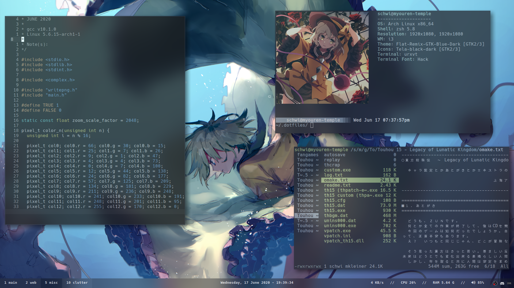
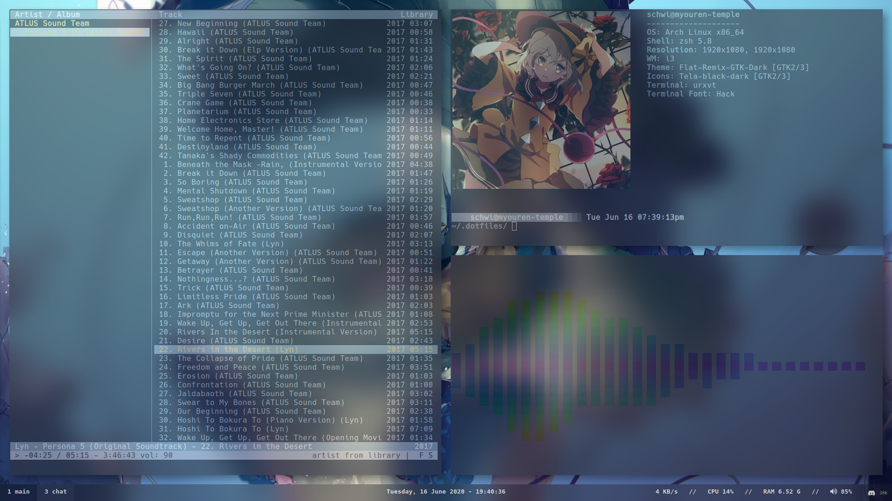
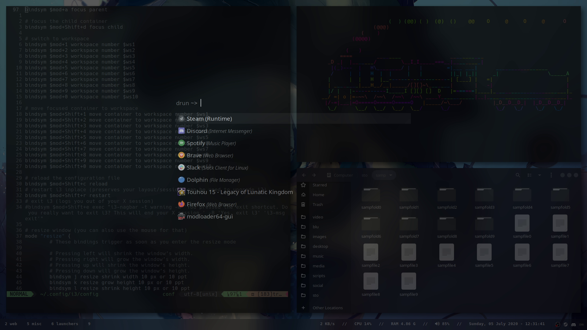

# Dotfiles

A backup of my dotfiles.

**SEE THE [WIKI](https://github.com/mrniceguy127/dotfiles/wiki) FOR MORE INFORMATION**

I've also included scripts to set everything up for you. Info on that is also on the wiki.

# Artwork Credits & Sources

NOTE: Some images have been AI upscaled/denoised

**Wallpapers**

Sources list may be updated as artwork is either changed, removed, or added in the repository. Sources may also be added if an unknown source is discovered.

- Wallpapers/orig-wp0003.1s.3n.png - Source: [Pixiv Artist: @えむかみ](https://www.pixiv.net/en/artworks/58823660)
- Wallpapers/koishi0007.cropped.1600x900.2s.0n.cropped.1920x1080.png - Source: [Pixiv Artist: @かずま](https://www.pixiv.net/en/artworks/61945190)

**neofetch**

- .config/neofetch/imgs/koishi0000.1s.3n.cropped.1133x1133.png - Source: [Pixiv Artist: @ぢせ](https://www.pixiv.net/en/artworks/76625949)

# Screenshots

