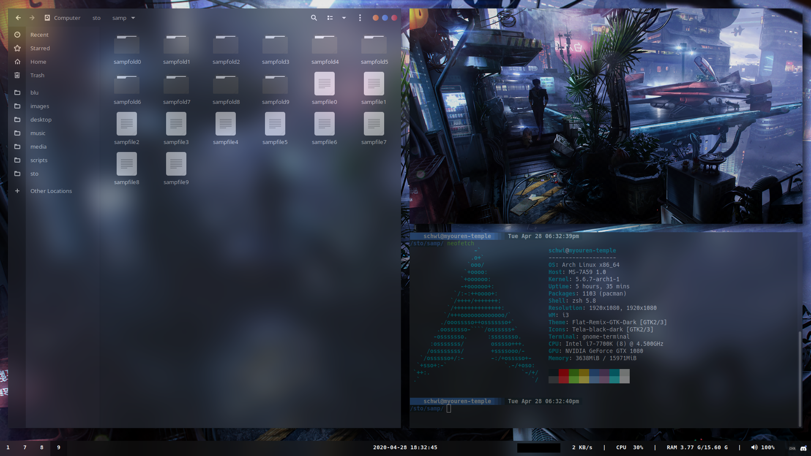
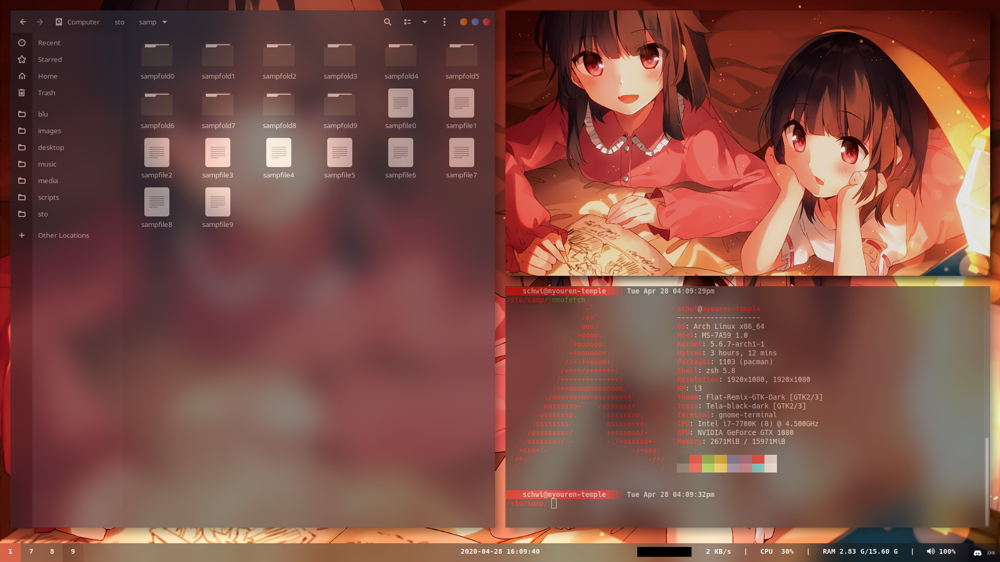

# Dotfiles

A backup of my dotfiles.
# Wallpaper Credit
NOTE: Some images have been AI upscaled

- Wallpapers/megumin0006.scaled.1920x1397.cropped.1920x1080.png - Source: Konosuba Light Novel Volume 11
- Wallpapers/cool-wp0000.2s.3n.scaled.2122x1080.cropped.1920x1080.png - Source: UNKNOWN, but can be found [here](https://osu.ppy.sh/beatmapsets/675779)
- Wallpapers/cb-wp0004.2s.0n.scaled.2535x1080.cropped.1920x1080.png - Source: [Artstation Artist: Romain Jouandeau](https://www.artstation.com/artwork/A61no)
- Wallpapers/ns-wp0001.2s.3n.scaled.1932x1080.cropped.1920x1080.png - Source: [Pixiv Artist: @シエラ](https://www.pixiv.net/en/artworks/65053285)
- Wallpapers/nue0002.rm-transp-corners.scale.1920x1080.png - Source: [Deviant Art Artist: @Carionto](https://www.deviantart.com/carionto/art/Touhou-Nue-Houjuu-minimalism-wallpaper-668541546)
- Wallpapers/orig-wp0003.1s.3n.png - Source: [Pixiv Artist: @えむかみ](https://www.pixiv.net/en/artworks/58823660)
- Wallpapers/orig-wp0004.png - Source: [Pixiv Artist: @焦茶](https://www.pixiv.net/en/artworks/74017219)
- Wallpapers/th-wp0002.2s.3n.cropped.1920x1080.png - Source: UNKNOWN, but can be found [here](https://osu.ppy.sh/beatmapsets/158023) OR [here](https://www.youtube.com/watch?v=lkicMsn-s_8)


## dotfile-utils

If you plan on using these scripts, it is assumed by default that this repo is stored in `$HOME/.dotfiles` (so that README.md is located at `$HOME/.dotfiles/README.md`).

If you wish to store this repo elsewhere, change these environment variables accordingly:

- **BAK_DEST**: Destination to backup dotfiles to, either during restoration or backup.
- **ORIGIN**: If restoring, this is the location of the *NEW* dotfiles (probably the location of this repo). If backing up, this is where you're *CURRENT* dotfiles are located (probably `$HOME`).
- **REPO_LOC**: Location of this repo. Default: `$HOME/.dotfiles`

### Scripts:
- restdots: backs up current conflicting dotfiles and restores the new dotfiles to those locations.
  - Default backup location when restoring is `$HOME/.dotfiles/restback`
- backdots: backs up current dotfiles by ***OVERWRITING THE FILES IN THIS REPOSITORY*** by default.
  - Define `BAK_DEST` and `ORIGIN` environment variables as needed.
- pulldots: Essentially just a git pull from origin.
  - Define the `REPO_LOC` environment variable if not using the default location.
- pushdots: A git add, commit (with your commit message), and push to origin/master of the entire repo.

Examples:
```
# Restore using default paths
./restdots

# Restore using alternate repo location
REPO_LOC="/some/alt/location/dotfiles" ./restdots

# Backup dotfiles using default paths
./backdots

# Push dotfiles to origin/master with a commit message from the default repo location.
./pushdots "This is what I changed"

# Pull dotfiles from origin/master.
./pulldots

# Pull and restore the new dotfiles from the repository (origin/master).
./pulldots && ./restdots

# Backup and push your current dotfiles to the repository with a commit message (origin/master).
./backdots && ./pushdots "This is what I changed."
```

# Screenshots

## 2020-04-28




